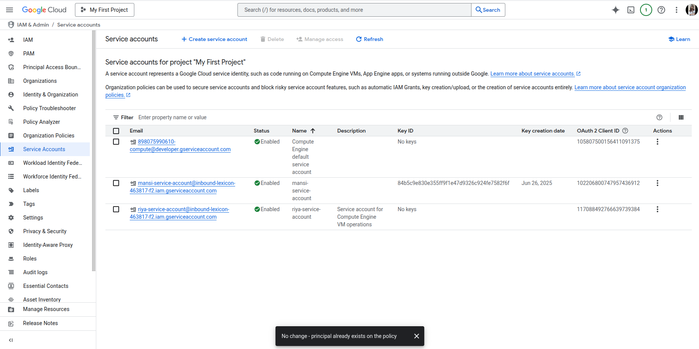

## GCP IAM & Service Accounts Assignment
### Project Overview
This project demonstrates the implementation of IAM roles, policies, and service accounts in Google Cloud Platform, following security best practices and the principle of least privilege.

### Tasks Completed
1. Custom IAM Roles Creation

Custom Role Name: customVMManager
Purpose: Provides specific VM management permissions without excessive privileges
Permissions Included:

compute.instances.get
compute.instances.list
compute.instances.start
compute.instances.stop
compute.instances.reset
compute.zones.get
compute.zones.list
compute.projects.get

2. Service Account Implementation

Service Account Name: riya-service-account
Purpose: Secure authentication for Compute Engine VM
Assigned Roles:

roles/logging.logWriter - For writing logs
roles/monitoring.metricWriter - For sending metrics

>

VM Integration: Attached to test-vm instance

3. Role Types Demonstration
> Primitive Roles

Role: roles/viewer
Scope: Project-level read access
Use Case: Basic read-only access for auditors

> Predefined Roles

Role: roles/compute.instanceAdmin
Scope: Full compute instance management
Use Case: System administrators managing VMs

> Custom Roles

Role: Day2-custom-role
Scope: Limited VM operations
Use Case: Developers needing specific VM control

### Security Implementation
Principle of Least Privilege Applied

> Service Account: Only logging and monitoring permissions
Custom Role: Only necessary compute permissions
User Assignments: Role-based access matching job functions

> Access Control Strategy
Separate roles for different user types
Minimal service account permissions
Regular role reviews and audits

### Core Concept Answers
1. Why is it dangerous to assign Editor role to all users in a production environment?
Answer: Assigning Editor role to all users is dangerous because:

Excessive Permissions: Editor role provides broad write access across almost all GCP services
Data Security Risk: Users can modify, delete, or corrupt critical production data
Configuration Changes: Users can alter infrastructure settings, potentially causing outages
Cost Impact: Users can create expensive resources leading to unexpected billing
Compliance Issues: Violates principle of least privilege and regulatory requirements
Audit Challenges: Difficult to track who made specific changes
Blast Radius: Single compromised account can affect entire project

Best Practice: Use role-based access control (RBAC) with specific roles matching job requirements.

2. How do service accounts differ from user accounts in managing backend services?

Service accounts differ from user accounts in several key ways:
Purpose & Design:

Service accounts are designed for application and service authentication, while user accounts are meant for human users
Service accounts represent applications, VMs, or automated processes rather than individual people

>Authentication Methods:

Service accounts use key-based authentication without passwords, relying on cryptographic keys or tokens
User accounts require password-based authentication, often combined with multi-factor authentication (MFA)

>Permission Structure:

Service accounts receive minimal, highly specific permissions tailored to exact service requirements
User accounts typically have broader permissions based on job roles and responsibilities across multiple systems

>Management Approach:

Service accounts are programmatically managed through APIs, infrastructure-as-code, and automation tools
User accounts require manual management for creation, updates, and access reviews

>Credential Rotation:

Service accounts support automated key rotation without service interruption
User accounts depend on manual password changes by users, creating potential security gaps

>Access Scope:

Service accounts are typically scoped to single applications or specific service functions
User accounts often need access across multiple applications and services for their daily work.

3. What practices help secure IAM in a multi-project GCP setup?
Answer: Key security practices for multi-project IAM:

I. Organizational Structure

Use Google Cloud Organization and folders
Implement hierarchical permissions
Separate environments (dev/staging/prod)

II. Access Management

Implement cross-project service accounts carefully
Use groups instead of individual user assignments
Regular access reviews and cleanup

III. Permission Strategy

Apply principle of least privilege per project
Use project-specific custom roles
Avoid organization-level broad permissions

IV. Monitoring & Auditing

Enable Cloud Audit Logs across all projects
Set up IAM policy change alerts
Regular permission audits

V. Automation

Use Infrastructure as Code (Terraform)
Automated policy deployment
Consistent role definitions across projects

VI. Security Controls

Enable VPC Service Controls
Use Access Context Manager
Implement conditional access policies

