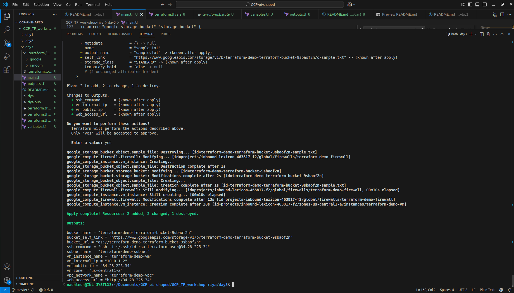

# Terraform GCP Infrastructure Automation

This project demonstrates basic infrastructure automation using Terraform to provision Google Cloud Platform (GCP) resources.

## Resources Created

This Terraform configuration creates the following GCP resources:

1. **VPC Network** - Custom virtual private cloud network
2. **Subnet** - Subnetwork within the VPC (10.0.1.0/24)
3. **Firewall Rules** - Allows SSH (22), HTTP (80), HTTPS (443), and custom port (8080)
4. **Compute Engine VM** - Ubuntu 20.04 LTS instance with Nginx web server
5. **Cloud Storage Bucket** - With versioning enabled and lifecycle rules
6. **Storage Object** - Sample file uploaded to the bucket

## Prerequisites

1. Google Cloud Platform account with billing enabled
2. GCP project created
3. Terraform CLI installed (version >= 1.0)
4. Google Cloud CLI installed and authenticated
5. SSH key pair generated

## Setup Instructions

### 1. Authentication Setup
```bash
# Login to GCP
gcloud auth login
gcloud auth application-default login

# Set your project
gcloud config set project YOUR_PROJECT_ID
```

### 2. SSH Key Setup
```bash
ssh-keygen -t rsa -b 4096 -C "your-email@example.com"
```

### 3. Configure Variables
Update the variables in `variables.tf` or create a `terraform.tfvars` file:

```hcl
project_id = "your-actual-project-id"
project_name = "my-terraform-demo"
region = "us-central1"
zone = "us-central1-a"
ssh_user = "your-username"
ssh_public_key_path = "~/.ssh/id_rsa.pub"
```

## Deployment Steps

### 1. Initialize Terraform
```bash
terraform init
```

### 2. Plan the Deployment
```bash
terraform plan
```


### 3. Apply the Configuration
```bash
terraform apply
```



### 4. View Outputs
```bash
terraform output
```

### 5. Clean Up Resources
```bash
terraform destroy
```

## Key Outputs

After successful deployment, you'll get:

- **VM Public IP**: External IP address to access your VM
- **Bucket URL**: Direct URL to your Cloud Storage bucket
- **Web Access URL**: Direct link to the Nginx web server
- **SSH Command**: Ready-to-use SSH command


## Terraform State

### What is Terraform State?

Terraform state is a file that maps your configuration to real-world resources. It contains:

- Resource metadata and configuration
- Dependencies between resources
- Performance optimization data
- Remote resource tracking

### State File Importance

1. **Resource Tracking**: Maps Terraform configuration to actual cloud resources
2. **Performance**: Caches resource attributes to avoid API calls
3. **Dependencies**: Tracks resource relationships for proper creation/destruction order
4. **Collaboration**: Enables team collaboration when stored remotely

### Security Risks of State Files

**Critical Security Considerations:**

1. **Sensitive Data Storage**: State files may contain:
   - Database passwords
   - API keys
   - Private keys
   - Other sensitive configuration data

2. **Access Control**: Local state files have no access control
3. **Version Control**: Never commit state files to version control
4. **Backup Security**: State backups must be secured

### Best Practices for State Management

1. **Use Remote State**: Store state in secure remote backends (GCS, S3, Terraform Cloud)
2. **Enable State Locking**: Prevent concurrent modifications
3. **Encrypt State**: Use encryption at rest and in transit
4. **Restrict Access**: Implement proper IAM controls
5. **Regular Backups**: Maintain secure, encrypted backups

## Core Concepts Explained

### 1. Declarative vs Imperative Infrastructure

**Declarative (Terraform):**
- Describes the desired end state
- Terraform determines how to achieve that state
- Idempotent operations
- Example: "I want 3 VMs with these specifications"

**Imperative (Scripts):**
- Describes step-by-step instructions
- Manual orchestration of create/update/delete operations
- Order-dependent operations
- Example: "Create VM1, then VM2, then configure networking"

### 2. When to Use Terraform vs Manual Provisioning

**Use Terraform When:**
- Managing complex, multi-resource infrastructure
- Need reproducible deployments
- Working in teams requiring collaboration
- Implementing CI/CD pipelines
- Managing multiple environments (dev/staging/prod)
- Need version control for infrastructure changes
- Compliance and audit requirements

**Use Manual Provisioning When:**
- One-off, simple resource creation
- Learning/experimenting with cloud services
- Emergency fixes requiring immediate action
- Resources that change very infrequently
- Small teams with simple infrastructure needs

## Benefits of Infrastructure as Code

1. **Version Control**: Track infrastructure changes over time
2. **Reproducibility**: Deploy identical environments consistently
3. **Collaboration**: Team-based infrastructure management
4. **Documentation**: Code serves as living documentation
5. **Testing**: Infrastructure can be tested and validated
6. **Cost Management**: Easy to spin up/down environments
7. **Disaster Recovery**: Quick infrastructure recreation

### 3. A team should use Terraform over manual provisioning in the following scenarios:

- Infrastructure as Code (IaC) is a priority
You need version-controlled, reproducible, and auditable infrastructure.

   Useful when multiple people are managing infrastructure — ensures consistency.

- Multiple environments (dev, staging, prod)
Terraform allows you to reproduce the same infrastructure across environments.

- Cloud-native, hybrid, or multi-cloud deployments
Terraform supports all major cloud providers (AWS, Azure, GCP, etc.).

- Frequent or large-scale infrastructure changes
Manual provisioning is slow and error-prone.

   Terraform can automate and document changes via terraform plan and terraform apply.

